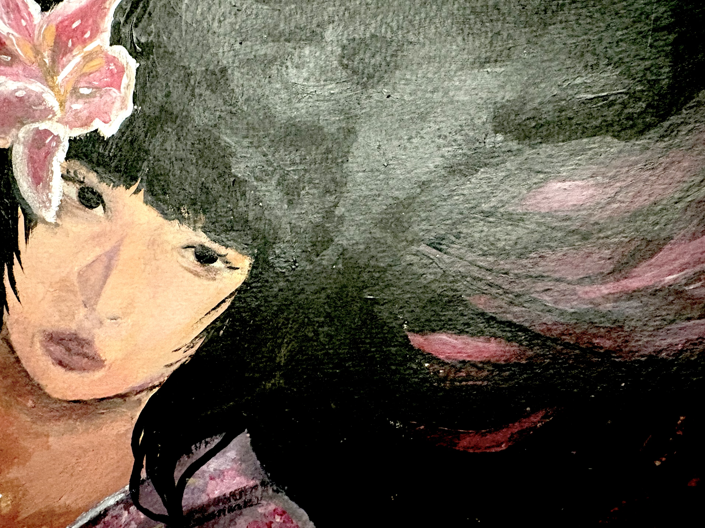
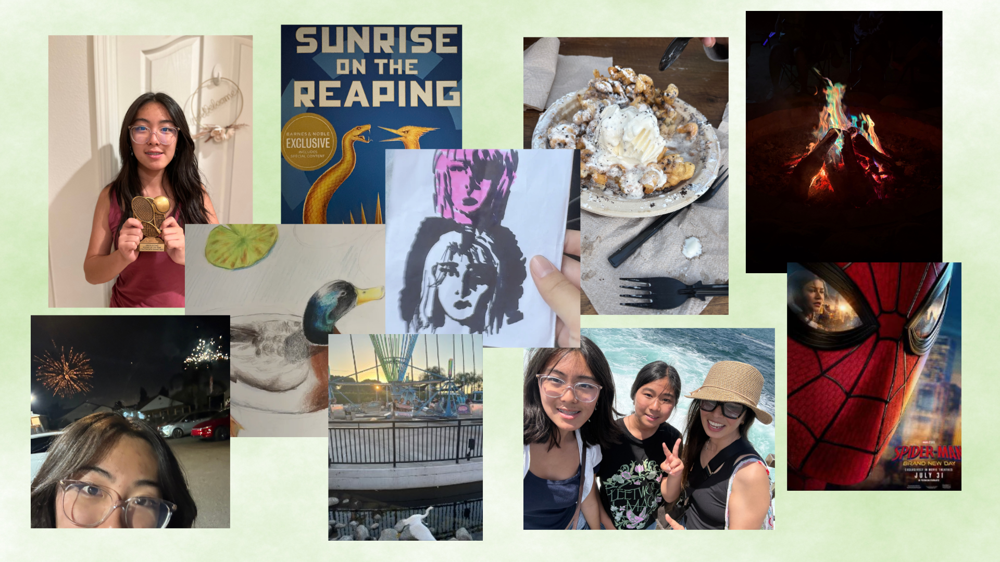

# <u> Me-in-Markdown: 2026 </u>

## Introduction/Letter to the Teacher 
Hello, my name is **Krista** and this is my "Me in Markdown" assignement. I am currently a **sophmore** and I am **14 years old**. Some hobbies of mine are painting, crocheting, playing video games, drawing, crafting, and tennis. I have enjoyed arts and crafts throughout all of my life and it has always been my most consistent hobby. Tennis is another hobby that I mentioned, and I play singles on our school's tennis team. I am Korean American and have lived in the United States my entire life. Though I have always lived in California, I used to live in Thousand Oaks and moved right before I started elementary school. For elementary and middle school, I went to Porter Ranch Community school. After I culminated In 8th grade, I decide to come to Chatsworth and join the G+ Steam Magnet!

This summmer I did not travel anywhere out of the state. However I did go to Santa Barbara and San Diego. In Santa Barabara I waent camping with people from my Church. It was very fun and I enjoyed spending quality time with my family and friends! I also went to San Diego over the fourth of July weekend. I went with my Mom, Dad, Sister, and cousins, I enjoyed that trip as well! Though I mentioned the two "big" trips I went on this summer, I also went to Six Flags with some of my friends and went to Knotts Berry Farm with my cousins. 

This year I am looking to challenge myself and attempt to plan a bit better than last year. I am hoping that by managing my time efficiently I will be able to be more productive and get better grades. Another goal I have this year is to hopefully pass all my AP tests. I am taking four AP classes this year, and though it may be stressful I really want to get passes on every single one. When test season comes around, I am going to make a study schedule. Though I do not often make schedules for studying, I think it will be beneficial this year. 

* ## My Top 10 Songs of 2026:
 #### Spotify playlist: [LINK](https://open.spotify.com/playlist/1nhjH1x6NdmVIwyFTwD6t8?si=Q2I-yGwpT22s3jqdMflHLg&utm_source=copy-link&pt=d13affb432eea5a8647d4498f9589113&pi=-qk8UkWQQe-d1)
My favorite song on the playist is **"Beaches"** by Beabadoobee

* ### My most recent painting:
 

* ### My Summer Collage 

